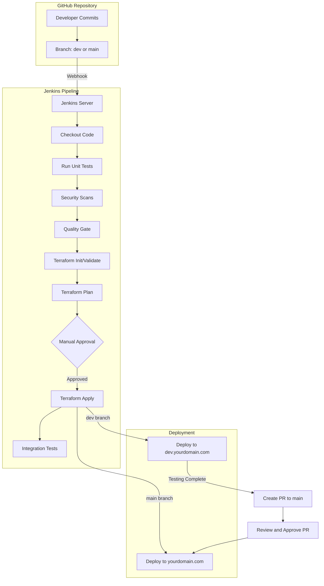

# CICD Pipeline Documentation

This document provides a detailed overview of our CI/CD pipeline implementation using Jenkins and GitHub. The pipeline automates the process of building, testing, and deploying our application across development and production environments.

## Pipeline Architecture

## Environment Strategy

- **Development Environment**
  - Triggered by commits to `dev` branch
  - Deploys to `https://dev.yourdomain.com`
  - Used for testing and validation before production

- **Production Environment**
  - Triggered by commits to `main` branch
  - Deploys to `https://yourdomain.com`
  - Only receives changes after thorough testing in development

## Pipeline Stages

### 1. Code Checkout
- Pulls the latest code from the GitHub repository
- Determines the branch name and sets up the appropriate environment variables

### 2. Unit Tests
- Runs all unit tests to verify basic functionality
- Fails fast if tests don't pass
- Generates JUnit test reports

### 3. Security Scanning
The pipeline employs multiple security scanning tools:

- **Checkov**
  - Infrastructure-as-code security scanner
  - Detects misconfigurations and security issues in Terraform code
  - Configured to check for AWS best practices and compliance

- **TFLint**
  - Specialized Terraform linter
  - Validates Terraform configurations against AWS provider rules
  - Ensures best practices in infrastructure definitions

- **OWASP Dependency Check**
  - Scans application dependencies for known vulnerabilities
  - Generates reports on any security issues found
  - Integrated with the pipeline quality gate

### 4. Quality Gate
- Evaluates test results and security scans
- For `dev` branch: Permits warnings but blocks on critical issues
- For `main` branch: Strict enforcement, all issues must be resolved

### 5. SonarCloud Integration
- Performs static code analysis
- Checks for code quality issues
- Enforces code coverage requirements
- Provides a quality gate that must pass before deployment

### 6. Terraform Workflow
- **Init**: Sets up the Terraform working directory
- **Validate**: Checks that configurations are syntactically valid
- **Plan**: Creates an execution plan showing changes to be applied
- **Apply**: Applies the changes after approval

### 7. Deployment Approval
- Dev environment: Simplified approval process (15-minute timeout)
- Production environment: Strict approval process (60-minute timeout)
- Requires confirmation that testing has been completed

### 8. Integration Tests
- Executes post-deployment tests against the live environment
- Verifies critical functionality
- Tests security headers and health check endpoints

## Branch Workflow

### Development Process
1. Developers check out the `dev` branch
2. Create feature branches from `dev`
3. Submit PRs back to `dev` when features are ready
4. Jenkins deploys changes to the dev subdomain
5. Manual testing is performed on the dev subdomain

### Production Deployment
1. Create PR from `dev` to `main`
2. Jenkins runs verification builds on the PR
3. PR is reviewed and approved by the team
4. PR is merged to `main`
5. Jenkins production pipeline runs
6. After manual approval, changes are deployed to production

## Security Measures

The pipeline includes several security measures:

1. **Scan Before Deployment**
   - Security checks run before any deployment
   - Critical issues block the pipeline

2. **Branch Protection**
   - `main` branch is protected
   - Requires passing checks and approvals before merging

3. **Approval Gates**
   - Manual approval required for deployment
   - Production deployments require additional verification

4. **Infrastructure Validation**
   - All infrastructure changes are validated and planned
   - Changes are visible for review before application

5. **Secrets Management**
   - Credentials are stored in Jenkins credentials store
   - No secrets in code or environment variables

## Testing Framework

The pipeline integrates multiple testing layers:

1. **Unit Tests**
   - Run early in the pipeline
   - Test individual components in isolation

2. **Infrastructure Tests**
   - Validate Terraform configurations
   - Test AWS resource specifications

3. **Security Tests**
   - Scan for security vulnerabilities
   - Check compliance with security policies

4. **Integration Tests**
   - Run post-deployment
   - Test the application as a whole
   - Verify functionality across components

## Jenkins Configuration

Jenkins is deployed as an ECS service in AWS with the following components:

- **Auto Scaling Group**: Ensures high availability
- **Network Load Balancer**: Provides external access
- **Jenkins Agents**: Dynamically scaled for parallel builds
- **Persistent Storage**: EFS for build history and configurations

## Troubleshooting

### Common Issues

1. **Build Failures**
   - Check the console output for specific errors
   - Look for failed tests or security issues
   - Verify that credentials are properly configured

2. **Deployment Issues**
   - Check AWS CloudWatch logs
   - Verify Terraform state in S3 bucket
   - Check security group and networking configurations

3. **Approval Timeout**
   - Pipeline approvals have timeouts (15 minutes for dev, 60 minutes for prod)
   - If missed, re-run the pipeline

### Support

For assistance with the CI/CD pipeline, contact:
- DevOps Team: devops@yourdomain.com
- Slack: #cicd-support

## Monitoring

The CI/CD pipeline is monitored through:

1. **Jenkins Dashboard**
   - Overview of all pipeline runs
   - Success/failure metrics

2. **CloudWatch Alerts**
   - Set up for pipeline failures
   - Monitors Jenkins infrastructure health

3. **Notification System**
   - Slack notifications for build status
   - Email alerts for critical failures

---

*Last updated: June 2024*